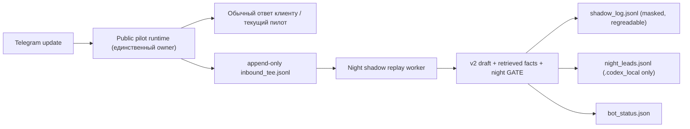

# Схема пассивного tee для ночной SHADOW-воронки

Дата: 2026-05-28  
Статус: proposal for Claude review, без live-запуска  
Связанные блоки: `TZ_night_funnel_autonomous_evening_2026-05-27.md`, коммит `353ce1bd`

## Решение

Для реального/тестового ночного трафика использовать **file-based passive tee**:

1. Единственный владелец Telegram update и ответа клиенту остаётся текущий public pilot runtime.
2. Владелец ответа пишет локальную копию входящего события в tee-log.
3. Отдельный shadow-replay читает tee-log и прогоняет уже реализованный night GATE.
4. Shadow-replay не имеет Telegram token, не вызывает `reply_text`, `send_message`, AMO, CRM, Tallanto.

Запрещённый вариант: запускать второй Telegram polling с тем же token. Telegram `getUpdates` не является broadcast-очередью; второй потребитель может съесть updates и оставить клиента без ответа.

## Поток



## Почему так

- Клиент не остаётся без ответа: только один процесс владеет Telegram update.
- Shadow наблюдает копию входящих, а не живой канал.
- Replay можно остановить, перезапустить и регрейдить без влияния на клиента.
- Логи можно передать Claude на проверку решений GATE.
- LIVE-send остаётся невозможным без отдельного будущего решения.

## Границы процессов

### Owner process

Файл: `scripts/run_telegram_public_pilot_bots.py`

Разрешено:
- читать Telegram update;
- отвечать клиенту как сейчас;
- писать append-only tee-log в локальную папку вне `stable_runtime`.

Запрещено:
- менять поведение ответа ради shadow;
- ждать shadow перед ответом;
- передавать shadow управление `reply_text` / `send_message`.

### Shadow replay process

Новый будущий entrypoint, например:

```text
scripts/run_telegram_night_shadow_replay.py
```

Разрешено:
- читать tee-log;
- строить v2 draft;
- прогонять `evaluate_night_gate`;
- писать `shadow_log.jsonl`, `night_leads.jsonl`, `bot_status.json`.

Запрещено:
- иметь Telegram bot token;
- отправлять сообщения клиентам;
- писать в AMO/CRM/Tallanto;
- писать в `stable_runtime`;
- запускать ASR/Resolve/Analyze.

## Tee-log: локальная схема

Путь по умолчанию:

```text
.codex_local/telegram_night_funnel/inbound_tee.jsonl
```

Одна строка:

```json
{
  "schema_version": "night_inbound_tee_v1_2026_05_28",
  "source": "telegram_public_pilot",
  "recorded_at": "2026-05-28T00:00:00+00:00",
  "brand": "foton",
  "channel_source": "https://cdpofoton.ru/?utm_source=direct&utm_campaign=...",
  "utm": {"utm_source": "direct"},
  "chat_id_hash": "sha256:...",
  "message_id": "12345",
  "message_at": "2026-05-28T00:00:00+00:00",
  "text": "сырой текст входящего для локального replay",
  "text_masked": "маска для audit pack",
  "known_context": {
    "recent_messages": [],
    "known_slots": {"grade": "9"}
  },
  "owner_runtime": {
    "answered_by_owner": true,
    "owner_route": "current_pilot",
    "owner_message_id": "..."
  }
}
```

Важно:
- `text` нужен для полноценного replay и хранится только локально в `.codex_local`.
- В audit pack и Claude-выгрузку отдавать `text_masked`, shadow-log и агрегаты.
- `parent_name` / `student_name` в review-лог не отдавать; это уже залочено в SHADOW-каркасе.

## Флаги

Owner process:

```text
TELEGRAM_NIGHT_FUNNEL_TEE_ENABLED=0      # default off
TELEGRAM_NIGHT_FUNNEL_TEE_PATH=.codex_local/telegram_night_funnel/inbound_tee.jsonl
TELEGRAM_NIGHT_FUNNEL_TEE_SOURCE=public_pilot
```

Shadow replay:

```text
TELEGRAM_NIGHT_FUNNEL_SHADOW_ONLY=1      # default and required
TELEGRAM_NIGHT_FUNNEL_SHADOW_ENABLED=1
TELEGRAM_NIGHT_FUNNEL_TEE_REPLAY_PATH=.codex_local/telegram_night_funnel/inbound_tee.jsonl
TELEGRAM_NIGHT_FUNNEL_LIVE_TOKEN=        # must be empty in replay
```

## Bot control / status

Сохраняем текущие файлы SHADOW-каркаса:

```text
.codex_local/telegram_night_funnel/bot_control.json
.codex_local/telegram_night_funnel/bot_status.json
.codex_local/telegram_night_funnel/shadow_log.jsonl
.codex_local/telegram_night_funnel/night_leads.jsonl
```

`bot_control.json` может остановить shadow-replay через `manual_kill_switch`, но не должен менять owner reply path.

## Предохранители

1. `TEE_ENABLED=0` по умолчанию.
2. Tee writer пишет только локальный append-only файл вне `stable_runtime`.
3. Replay не получает Telegram token.
4. Replay не импортирует и не вызывает Telegram `send_message`.
5. LIVE-send в night gate остаётся заблокирован двумя предохранителями из SHADOW-каркаса.
6. Все пути записи проходят guard против `stable_runtime`.
7. При любой ошибке tee writer логирует ошибку и не ломает клиентский ответ.

## Проверки перед первым passive shadow-прогоном

Автотесты:
- tee writer пишет запись при входящем сообщении;
- tee writer не меняет и не блокирует обычный reply path;
- tee path в `stable_runtime` отвергается;
- replay не требует Telegram token;
- replay не вызывает `reply_text` / `send_message`;
- replay пишет shadow-log с fact-levels и masked lead;
- P0/wrong_scope/no_match не переходят в AUTO_SEND;
- `text_masked` не содержит phone/email/raw parent/student names.

Ручной чек:
- показать Claude 5-10 строк tee-log на синтетике/тестовом канале;
- подтвердить, что owner runtime отвечает клиенту независимо от replay;
- подтвердить, что `.codex_local/telegram_night_funnel/*` не попадает в git.

## Первый безопасный запуск после ревью схемы

1. Включить tee только на тестовом канале или на ограниченном ночном окне.
2. Не включать replay одновременно с LIVE-send; replay только shadow.
3. Собрать 20-50 входящих или одну ночь, что меньше.
4. Передать Claude:
   - `shadow_log.jsonl`;
   - `bot_status.json`;
   - masked sample tee rows;
   - summary decision counts;
   - список `AUTO_SEND` candidates.
5. Claude регрейдит только решения GATE, не клиентские отправки.

## Открытые бизнес-вопросы до live

- Кто утром реально смотрит `night_leads.jsonl`.
- До какого часа можно обещать ответ менеджера.
- С какого бренда и рекламного источника начинать.
- Ночной лимит N.
- Срок хранения локальных lead/tee логов.

## Моя рекомендация

Утвердить именно file-based tee + replay. Это минимально рискованно: реальный клиентский канал остаётся в одном owner-процессе, а shadow становится воспроизводимым и регрейдабельным.

Не делать webhook fan-out и второй polling на этом этапе.

---

## Ревью Claude #1 (2026-05-28): УТВЕРЖДАЮ + 2 добавления

Схема правильная и минимально рискованная. Ключевые предохранители на месте и закрывают мои требования:
единственный владелец Telegram update и ответа; replay БЕЗ token и физически не умеет слать; tee fail-safe
(ошибка tee не ломает клиентский ответ — предохранитель 7); owner не ждёт shadow перед ответом; сырой
`text` только в `.codex_local`, в выгрузку — `text_masked`; имена не в review-лог. Запрет второго polling
обоснован верно (getUpdates не broadcast). Replay re-прогоняет v2-пайплайн в night-режиме — это и нужно
(мы оцениваем именно автономный ночной черновик, а не дневной).

ДОБАВИТЬ перед реализацией (оба — мелкие, но обязательные):

1. **Идемпотентный replay (курсор/offset + dedup).** Append-only tee + перезапуск replay не должен
   пере-обрабатывать старые строки (иначе двойной счёт в bot_status/leads). Хранить позицию (offset или
   обработанные message_id) в `.codex_local`; тест на «перезапуск replay не дублирует решения».
2. **Конкретная ретенция/ротация `inbound_tee.jsonl`.** Это сырые ПДн на диске. До РЕАЛЬНОГО трафика
   (не тестового) задать срок хранения + ротацию/очистку сырого tee после обработки/срока. На тестовом
   канале можно мягче; на реальном — обязательно.

И один эксплуатационный чек (не правка схемы): подтвердить, что owner (public pilot) реально является
боевым приёмником для нужного канала — иначе tee на реальном трафике ничего не поймает. Поэтому первый
запуск — на ТЕСТОВОМ канале/ограниченном окне, как в схеме.

Порядок: внести 2 добавления → реализовать tee + replay-entrypoint с тестами из раздела «Проверки» →
показать мне 5-10 masked tee-строк + подтверждение независимости owner-ответа + что `.codex_local` вне git
→ пассивный shadow-прогон на тестовом канале (20-50 входящих) → я регрейжу решения GATE. LIVE — не раньше
отдельного решения после этого.
