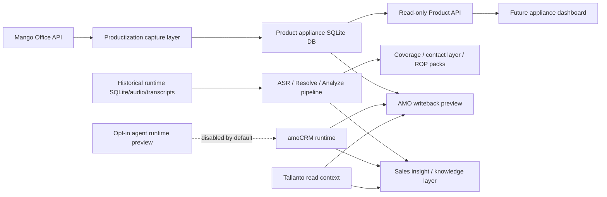

# Current Architecture

Дата: 2026-05-09

Назначение: зафиксировать текущее устройство проекта перед переходом к новым
фичам SaaS/productization ветки. Это не целевая архитектура "когда-нибудь", а
карта того, что уже есть в коде и какие границы нельзя случайно нарушать.

## Executive summary

Проект сейчас состоит из двух больших контуров:

1. Historical processing pipeline - текущая обработка звонков, ASR, Resolve,
   Analyze, coverage и операционные batch-скрипты.
2. Productization/SaaS contour - новый изолированный слой для Mango API capture,
   product DB, read-only Product API, scheduler dry-runs, AMO writeback guards,
   insights и будущего UI.

Главное архитектурное решение: новый продуктовый слой не должен напрямую
мутировать `stable_runtime` DB/audio/transcripts и не должен запускать ASR/R+A.
Он может читать готовые данные, строить staging/product artifacts и показывать
preview/gates.

## Current layer map



## Layer 1. Historical processing pipeline

Purpose:

- ingest local call recordings;
- transcribe calls;
- resolve dialogue structure;
- run structured analysis;
- prepare coverage, contact-layer, ROP and AMO-ready outputs.

Primary code:

- `src/mango_mvp/models.py`
- `src/mango_mvp/services/`
- `src/mango_mvp/cli.py`
- processing-owned scripts such as `prepare_*`, `finalize_*`, `prefill_*`,
  `run_analyze_ab_test.py`

Primary data:

- `stable_runtime/`
- current runtime SQLite DBs;
- audio/transcripts/analysis artifacts;
- coverage reports.

Ownership:

- processing dialog owns transcript quality, ASR/R+A quality and active pipeline
  fixes.

Rules for this SaaS/productization dialog:

- do not mutate runtime DB/audio/transcripts;
- do not run ASR/R+A;
- do not edit active batch/start/run-ui scripts without explicit approval.

## Layer 2. Productization capture layer

Purpose:

- read Mango Office API in shadow mode;
- normalize provider payload into stable events;
- dedupe calls;
- plan capture/download actions;
- preserve raw payload provenance.

Primary code:

- `src/mango_mvp/productization/contracts.py`
- `src/mango_mvp/productization/mango_office_client.py`
- `src/mango_mvp/productization/mango_office.py`
- `src/mango_mvp/productization/capture.py`
- `src/mango_mvp/productization/capture_inbox.py`
- `src/mango_mvp/productization/recording_capture_plan.py`
- `src/mango_mvp/productization/recording_capture_download.py`

Primary scripts:

- `scripts/mango_office_shadow_poll.py`
- `scripts/mango_office_capture_inbox.py`
- `scripts/mango_office_recording_capture_plan.py`
- `scripts/mango_office_recording_capture_download.py`

Safety:

- shadow poll is `NETWORK_READ_ONLY`;
- guarded download is `CONTROLLED_DOWNLOAD`;
- no ASR/R+A trigger;
- no runtime DB writes.

## Layer 3. Product appliance DB

Purpose:

- local product-level operational store;
- separate from historical runtime DB;
- suitable for client-hosted appliance phase while SQLite remains acceptable.

Primary code:

- `src/mango_mvp/productization/product_db.py`
- `src/mango_mvp/productization/repository.py`
- `src/mango_mvp/productization/tenant_owner_mapping.py`

Current schema version:

- `product_appliance_sqlite_v1`

Important tables:

- `tenants`
- `provider_accounts`
- `crm_accounts`
- `tenant_manager_owner_map`
- `product_calls`
- `job_types`
- `job_runs`
- `capture_inbox_items`
- `tenant_config_history`
- `retention_policies`

Boundary:

- product DB is not the same as `stable_runtime` runtime DB;
- Product API and future UI should use product DB contracts, not direct runtime
  internals.

## Layer 4. Read-only Product API

Purpose:

- provide stable JSON contracts for UI and appliance dashboard;
- centralize safety policy instead of letting UI call scripts directly.

Primary code:

- `src/mango_mvp/productization/product_api.py`
- `src/mango_mvp/productization/product_api_http.py`
- `src/mango_mvp/productization/ui_contracts.py`

Current contract version:

- `product_api_readonly_v1`
- `saas_ui_contracts_v1`

Current endpoints/facade methods:

- dashboard summary;
- recent capture events;
- scheduler runs;
- ASR gate status;
- writeback previews;
- processing queue;
- knowledge playbook placeholder;
- adapter settings;
- SaaS stage gates.

Safety:

- read-only by design;
- mutation routes should be blocked in UI/API v1;
- `write_crm`, `run_asr`, `run_ra`, `write_runtime_db` remain blocked actions.

## Layer 5. Scheduler and appliance loop

Purpose:

- model recurring product jobs without shell-only operational state;
- keep dry-run behavior explicit;
- prepare for a future supervisor UI.

Primary code:

- `src/mango_mvp/productization/scheduler_runtime.py`
- `src/mango_mvp/productization/appliance_loop.py`
- `src/mango_mvp/productization/supervisor.py`

Primary scripts:

- `scripts/mango_office_scheduler_runtime.py`
- `scripts/mango_office_appliance_loop_dry_run.py`

Current statuses:

- `planned`
- `running`
- `succeeded`
- `retry_wait`
- `failed`
- `blocked`
- `skipped`

Safety:

- scheduler can record planned/dry-run operational rows;
- product jobs are policy-gated;
- ASR execution remains approval-gated and not automatic.

## Layer 6. AMO/Tallanto runtime and writeback guards

Purpose:

- connect to amoCRM and Tallanto;
- read contacts/deals/statuses/context;
- build deal dossiers and writeback previews;
- allow live writeback only through explicit confirmation.

Primary code:

- `src/mango_mvp/amocrm_runtime/`
- `scripts/write_amo_ready_contacts.py`
- `scripts/write_recent_actionable_deals.py`

Current live-write rule:

```zsh
--execute-live-write --live-confirmation WRITE_AMO_LIVE
```

HTTP writeback also requires:

```json
{
  "execute_live_write": true,
  "live_confirmation": "WRITE_AMO_LIVE"
}
```

Safety:

- CLI defaults to dry-run/preview;
- HTTP writeback refuses without confirmation;
- Tallanto is read-only in current productization scope;
- legacy `sync_amocrm` is deprecated and disabled by default.

## Layer 7. Sales insight and knowledge layer

Purpose:

- turn analyzed conversations into product knowledge;
- extract customer signals, manager answer patterns, outcomes, ROP validation
  packs and playbook candidates.

Primary code:

- `src/mango_mvp/insights/`
- `scripts/build_sales_insight_knowledge_base.py`
- `scripts/run_transcript_quality_stage15_gate.py`
- `scripts/build_outcome_linkage_report.py`
- `scripts/build_pilot_sales_moments.py`
- `scripts/build_rop_validation_pack.py`

Safety:

- reads completed transcript/analysis outputs;
- writes reports and knowledge artifacts;
- does not write CRM;
- does not run ASR/R+A.

## Layer 8. Opt-in agent runtime preview

Purpose:

- preview future agent actions;
- store proposed actions, policies and dry-run results.

Primary code:

- `src/mango_mvp/amocrm_runtime/agent_runtime.py`
- `src/mango_mvp/amocrm_runtime/agent_models.py`
- `src/mango_mvp/amocrm_runtime/routers/agent.py`

Safety:

- disabled by default;
- enabled only with `AI_OFFICE_AGENT_RUNTIME_ENABLED=1`;
- live L4 actions are blocked by policy;
- dry-run/approval queue behavior is covered by tests.

## Cross-cutting safety docs

Canonical operational docs:

- `docs/OPERATIONS_RUNBOOK_2026-05-07.md`
- `docs/SCRIPT_SAFETY_MATRIX.md`
- `docs/CLI_AND_SCRIPTS_CATALOG_2026-05-07.md`
- `docs/AMO_TALLANTO_FIELD_MAPPING_PROD.md`
- `docs/PROJECT_RISK_AUDIT_RESPONSE_PLAN_2026-05-09.md`

Current safety principle:

```text
read -> normalize -> preview -> gate -> limited live -> audit -> rollback
```

## What is ready for new features

Ready:

- read-only Product API contracts;
- product DB schema;
- Mango shadow poll and capture planning;
- scheduler dry-run foundation;
- AMO writeback guards;
- script safety matrix;
- insight layer skeleton and reports.

Not ready yet:

- direct UI actions that mutate runtime DB;
- unattended CRM writes;
- automatic ASR/R+A trigger from Product API;
- external-client handoff without secrets/support-bundle review;
- PostgreSQL migration of active queues.

## Recommended next feature direction

The safest and most useful next feature is a local appliance dashboard over the
existing read-only Product API:

- dashboard summary;
- capture inbox;
- scheduler runs;
- writeback readiness;
- knowledge readiness;
- settings/safety state.

This turns the accumulated productization work into a visible product surface
without changing runtime processing or live CRM behavior.

## Current Transcript Quality Export Gate

Stage 15 adds a permanent export gate after downstream Knowledge Base/ROP generation and before bot/CRM production use. The gate is implemented in `src/mango_mvp/quality/stage15_export_quality_gate.py` and exposed through `scripts/run_transcript_quality_stage15_gate.py`. It checks Stage14 acceptance, zero residual bot-safe risks, zero required baseline risks, input-root consistency, audit sample uniqueness, a strict bot export allowlist and an independent adversarial detector for spoken money, short money notation, messenger handles, brand variants and likely single-name PII.

The only file intended for Telegram bot/RAG ingestion is `bot_export_allowlist.csv` from the Stage15 output root. Internal ROP files, enriched reviews, raw ideal answers, manager answers, phone numbers and source filenames are not bot-ingestion artifacts. CRM writeback remains guarded by the existing staged preview/live confirmation policy.
